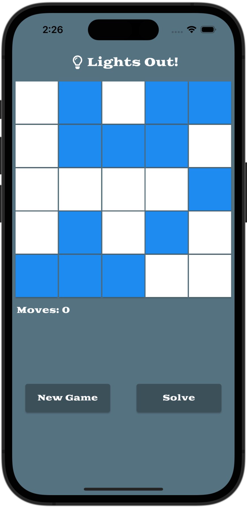
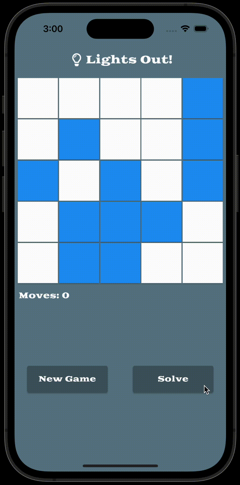

# Lights Out

## About

This project is a simple implementation of the "Lights Out" for my personal
portfolio.  

Since this is a portfolio project you may find the documentation and comments
to be verbose. This is because I want to convey my line of thinking in the
code.

## How It Works

When starting the app you will see the game screen in the intitial state:

<p align="center">
    
</p>

The object to to remove all the blue tiles by toggling them on or off. When
a tile is toggled, the adjacent tiles are also toggled. If you want to start
over, you can click the `New Game` button. If you want the game to be
automatically solved, click the `Solve` button:

<p align="center">
    
</p>

## Build

This project was built with Flutter 3.3.8. To build and run the app:

1. [Install Flutter](https://docs.flutter.dev/get-started/install)
2. Run `Flutter Run` from the root directory of the project

This should bring the app up in your selected simulator or connected device.
If you need to start a simulator, you can use the Flutter emulator command to
see what you have installed. 

```
$ flutter emulators                        
2 available emulators:

apple_ios_simulator • iOS Simulator  • Apple  • ios
Pixel_5_API_32      • Pixel 5 API 32 • Google • android
```

Then you can run the emulator using:

```
flutter emulators --launch Pixel_5_API_32
```

You can also run the project in Chrome using the following command:

```
flutter run -d chrome
```

## Release

Building release packages for various devices can be a bit involved. Please
see the Flutter documentation on how to deploy to
[iOS](https://docs.flutter.dev/deployment/ios) or 
[Android](https://docs.flutter.dev/deployment/android).